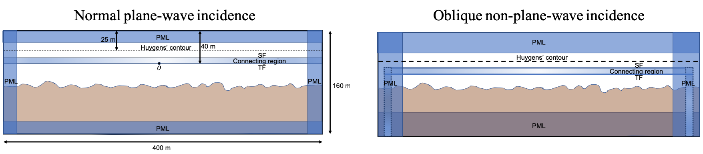

# Pseudo-Spectral Time-Domain (PSTD) Method for Simulation of Radar Echoes from Large Heterogeneous Domains

This is a MATLAB-based two-dimensional (2D) PSTD full-wave simulator for solving large-scale (e.g. 10-1000 wavelength) low-frequency (e.g. HF) electromagnetic scattering problems with the application of radar sounding of planetary subsurfaces.

Developed by Yang Lei (GPS/Caltech, ylei@caltech.edu), Darmindra Arumugam (JPL/Caltech, darmindra.d.arumugam@jpl.nasa.gov), Mark Haynes (JPL/Caltech, Mark.S.Haynes@jpl.nasa.gov)

Copyright (C) 2019 California Institute of Technology.  Government Sponsorship Acknowledged.

Reference: Y. Lei, M. S. Haynes, D. Arumugam and C. Elachi, "A 2-D Pseudospectral Time-Domain (PSTD) Simulator for Large-Scale Electromagnetic Scattering and Radar Sounding Applications," in IEEE Transactions on Geoscience and Remote Sensing.
DOI: 10.1109/TGRS.2019.2960751 URL: http://ieeexplore.ieee.org/stamp/stamp.jsp?tp=&arnumber=8957426&isnumber=4358825

## Features:

### * Memory Efficient and Accurate Compared to FDTD
The grid sampling resolution approaches the limit of minimum wavelength being simulated divided by 2.

### * Standard FDTD/PSTD components included, e.g.
* Total Field/Scattered Field Formulation
* Near-to-far field transformation 
* Connecting region method
* Perfectly Matched Layer (PML) and Generalized PML

### * Various Transmit Waveforms, e.g.
* Gaussian
* Blackman-Harris
* Sinc
* Hanning

### * Dielectric Cylinder

### * Novel Simulation Domain Design for Half-space Electromagnetic Scattering Problems

### * Random Dielectric Rough Surface/Random Dielectric Volume

### * Both Normal and Oblique Incidence of Arbitrary Wave Source
* Plane wave source 
* Spherical wave source 

### * Along-track Active and Passive SAR Focusing of Radargram

(a) scene of dielectric constant, (b) unfocused radargram, (c) focused radargram, (d) focused radargram after refraction correction

### * Cross-track Clutter and Subsurface in SAR-focused Radargram

### * Simple to Use for Radar Sounding Applications: 
* one MATLAB command 
* standard input parameters for radar sounder system and sounding geometry
* outputs include far field waveforms and unfocused/focused radargram as user specified

## Instructions:

* Copy the PSTD main directory under MATLAB search path
* Run "PSTD.m" from the PSTD main directory and refer to it for specific meanings of the individual input and output parameters.
* Refer to and modify "dielectric_scene.m" for accommodating the customized dielectric scene. Otherwise, the default setting can handle 1) point target, 2) dielectric cylinder, 3) random dielectric surface, 4) random dielectric volume, and 5) combinations of all of the above.
* Modify "application_example.m" for individual post-processing applications based on output from running PSTD.m. The current version ingests the far fields (output from the PSTD run) in active focusing mode at user-specified receiver locations, and then reproduces the focused radargram.
* Please also refer to the upcoming technical draft associated with this simulator (Lei et al.; under review) for detail of the domain design (e.g. definition of the origin of the coordinates).
* Screenshots of the animation saved as a short video file, named "video.mp4" in the PSTD main directory.
